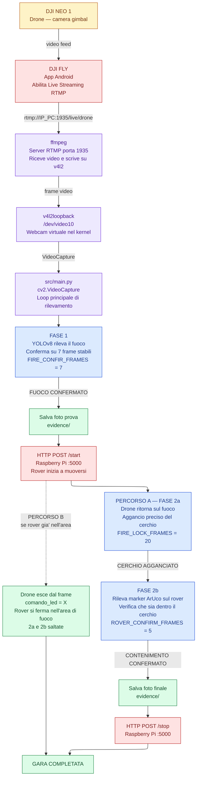
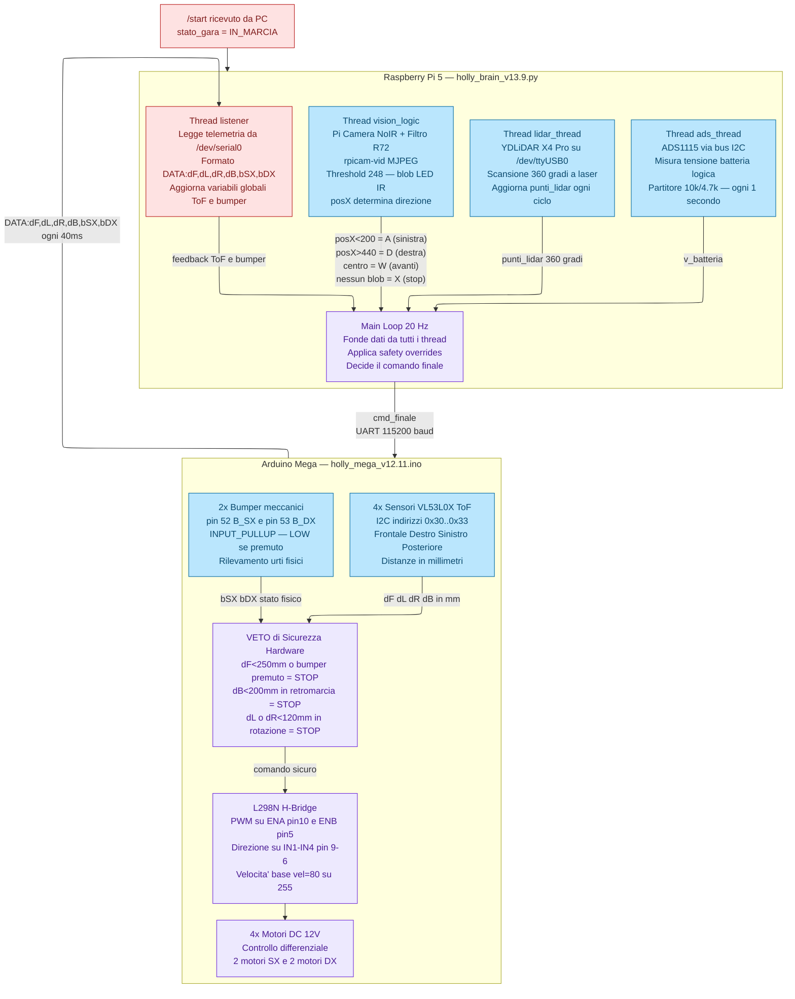
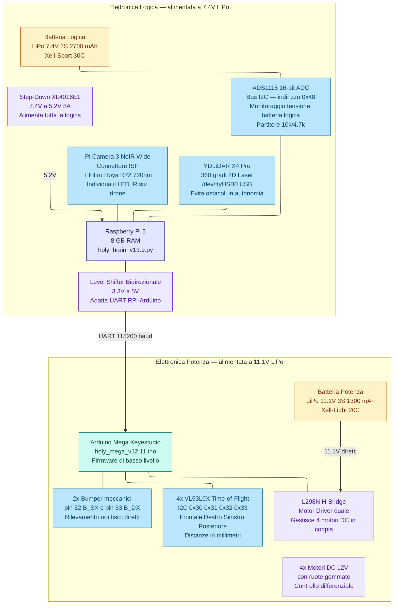
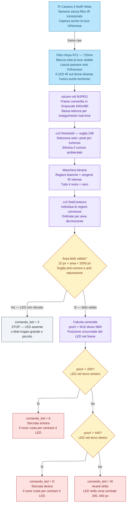

# Dronebot 2026 — Team Holly

Documentazione tecnica integrale del sistema di rilevamento fuoco e coordinamento rover per la gara Dronebot 2026.
Il sistema e' composto da due sottosistemi che comunicano via rete WiFi: uno **Script PC** per il rilevamento tramite drone DJI NEO 1, e un **Rover autonomo** guidato da Raspberry Pi 5 e Arduino Mega Keyestudio.

- **Istituto:** ITC Vincenzo Arangio Ruiz — Roma
- **Dipartimento:** Informatica e Telecomunicazioni
- **Team:** TEAM HOLLY

---

## Indice

1. [Come funziona](#come-funziona)
2. [Pipeline Completa del Sistema](#pipeline-completa-del-sistema)
3. [Pseudocodice](#pseudocodice)
4. [Il Rover Holly](#il-rover-holly)
5. [Firmware Arduino Mega V12.11](#firmware-arduino-mega-v1211)
6. [Script Raspberry Pi 5 V13.9](#script-raspberry-pi-5-v139)
7. [Configurazione OS Raspberry Pi](#configurazione-os-raspberry-pi)
8. [Prerequisiti](#prerequisiti)
9. [Installazione](#installazione)
10. [Connessione con RTMP live streaming](#connessione-con-rtmp-live-streaming)
11. [Connessione del dispositivo Android](#connessione-del-dispositivo-android)
12. [Configurazione PC](#configurazione)
13. [Utilizzo](#utilizzo)
14. [Generazione marker ArUco](#generazione-marker-aruco)
15. [BOM — Bill of Materials](#bom--bill-of-materials)
16. [SBOM — Software Bill of Materials](#sbom--software-bill-of-materials)
17. [Risoluzione problemi](#risoluzione-problemi)
18. [Licenza](#licenza)

---

## Come funziona

La gara si svolge in due fasi gestite automaticamente dallo script.

### Fase 1 — Rilevamento del fuoco

Il pilota porta il drone sull'area di fuoco. Lo script usa YOLO per rilevare il fuoco in tempo reale.
Quando la rilevazione e' stabile per `FIRE_CONFIR_FRAMES` frame consecutivi l'incendio viene confermato, viene salvata una foto come prova e viene inviato il **Segnale 1** al rover via HTTP.
Il rover riceve il segnale e inizia a prepararsi per il tracciamento.

### Fase 2 — Coordinamento rover

La Fase 2 puo' concludersi in due modi distinti, garantendo ridondanza operativa.

**Percorso A — Verifica automatica completa (primario)**

Il pilota torna nell'area del rover. Il rover inizia a seguire il drone tramite il LED IR. Il pilota riporta lentamente il drone sopra l'area di fuoco e lo mantiene fermo.

**Fase 2a — Blocco del cerchio:** Lo script rileva nuovamente il fuoco e, quando la posizione e' stabile per `FIRE_LOCK_FRAMES` frame consecutivi, blocca il centro e il raggio del cerchio di fuoco come riferimento preciso. Questo riferimento e' piu' accurato di quello della Fase 1 perche' il drone e' esattamente sopra il fuoco alla quota di verifica.

**Fase 2b — Verifica contenimento ArUco:** Lo script verifica che tutti e quattro gli angoli del marker ArUco montato sul rover siano all'interno del cerchio bloccato. Il centro del cerchio viene aggiornato frame per frame per compensare il leggero drift del drone in hovering. Quando la condizione e' soddisfatta per `ROVER_CONFIRM_FRAMES` frame consecutivi, il contenimento viene confermato, viene salvata la foto finale come prova e viene inviato `/stop` al rover via HTTP.

**Percorso B — Ridondanza passiva (se pilota esperto)**

Se le condizioni lo permettono, il rover segue il drone direttamente nell'area di fuoco senza passare per il lock o la verifica ArUco: le Fasi 2a e 2b vengono saltate interamente. Quando il drone esce dall'inquadratura, il thread `vision_logic` non rileva piu' il LED IR e imposta `comando_led = X`. Il rover si ferma autonomamente nella posizione corrente all'interno del cerchio di fuoco. I due percorsi sono indipendenti: la ridondanza garantisce il completamento anche in caso di perdita del segnale video.

---

## Pipeline Completa del Sistema

Il flusso completo dei dati, dall'acquisizione video del drone fino ai motori del rover.

### Lato PC



### Lato Rover



---

## Pseudocodice

### Script PC — Drone side (V13.x)

> **INIZIO**
>
> > Apri `VideoCapture` da `/dev/video10`
> >
> > Carica modello YOLOv8 `best.pt`
> >
> > Inizializza `ARUCODetector` — dizionario `DICT_4X4_50`, ID `10`
> >
> > Imposta `FASE = 1`
>
> **RIPETI all'infinito:**
>
> > Leggi frame dalla webcam virtuale
> >
> > SE frame non valido: `continua`
> >
> > **SE** `FASE == 1`:
> >
> > > Esegui YOLOv8 sul frame
> > >
> > > PER ogni detection con area `>= MIN_FIRE_AREA`:
> > >
> > > > Calcola spostamento centro rispetto al frame precedente
> > > >
> > > > SE spostamento `< MAX_FIRE_SHIFT`: `streak += 1`
> > > >
> > > > ALTRIMENTI: `streak = 0`
> > >
> > > SE `streak >= FIRE_CONFIR_FRAMES`:
> > >
> > > > Salva foto prova in `evidence/`
> > > >
> > > > `HTTP POST /start` → Raspberry Pi `:5000`
> > > >
> > > > `FASE = 2`
> >
> > **SE** `FASE == 2` E cerchio **non agganciato**:
> >
> > > Esegui YOLO → cerca detection con area `>= MIN_FIRE_AREA`
> > >
> > > SE trovata e spostamento stabile: `fire_lock_streak += 1`
> > >
> > > ALTRIMENTI: `fire_lock_streak = 0`
> > >
> > > SE `fire_lock_streak >= FIRE_LOCK_FRAMES`:
> > >
> > > > Calcola centro e raggio dalla bounding box
> > > >
> > > > Cerchio → **AGGANCIATO**
> >
> > **SE** `FASE == 2` E cerchio **agganciato**:
> >
> > > Aggiorna centro cerchio con nuova detection YOLO (drift compensation)
> > >
> > > Esegui `ARUCODetector` sul frame
> > >
> > > SE marker ArUco trovato:
> > >
> > > > SE tutti e 4 gli angoli sono nel cerchio: `rover_streak += 1`
> > > >
> > > > ALTRIMENTI: `rover_streak = 0`
> > > >
> > > > SE `rover_streak >= ROVER_CONFIRM_FRAMES`:
> > > >
> > > > > Salva foto finale in `evidence/`
> > > > >
> > > > > `HTTP POST /stop` → Raspberry Pi `:5000`
> > > > >
> > > > > **ESCI**
> >
> > Mostra frame a schermo
> >
> > SE tasto `ESC` o `Q`: **ESCI**
>
> **FINE**

---

### Firmware Arduino Mega (V12.11)

> **INIZIO**
>
> > Inizializza pin motori `ENA=10, ENB=5, IN1..IN4=9..6` come Output
> >
> > Inizializza pin bumper `B_SX=52, B_DX=53` come Input con Pull-up
> >
> > Porta tutti i pin XSHUT `14,15,16,17` a LOW — tutti i sensori spenti
> >
> > Avvia `Serial1` a 115200 baud verso Raspberry Pi
> >
> > Avvia bus I2C
> >
> > **AVVIO SEQUENZIALE SENSORI ToF:**
> >
> > > PER ogni sensore (Frontale, Destro, Sinistro, Posteriore):
> > >
> > > > Porta il pin XSHUT del sensore a HIGH
> > > >
> > > > Attendi 50 ms
> > > >
> > > > Assegna indirizzo I2C univoco `0x30, 0x31, 0x32, 0x33`
> > > >
> > > > Avvia lettura continua
>
> **RIPETI all'infinito:** (ciclo 40 ms ≈ 25 Hz)
>
> > Leggi `dF, dL, dR, dB` dai 4 sensori ToF in mm
> >
> > Leggi `bSX = (pin52 == LOW)`, `bDX = (pin53 == LOW)`
> >
> > SE `Serial1.available() > 0`: leggi carattere comando `(W, S, A, D, X)`
> >
> > ALTRIMENTI: mantieni l'ultimo comando ricevuto
> >
> > **VETO DI SICUREZZA:**
> >
> > > SE comando `W` E (`dF < 250` OPPURE `bSX` OPPURE `bDX`): `azione = X`
> > >
> > > SE comando `S` E `dB < 200`: `azione = X`
> > >
> > > SE comando `A` E `dL < 120`: `azione = X`
> > >
> > > SE comando `D` E `dR < 120`: `azione = X`
> > >
> > > ALTRIMENTI: `azione = comando`
> >
> > **ESECUZIONE MOVIMENTO:**
> >
> > > `W` → `muovi(+vel, +vel)` — avanti
> > >
> > > `S` → `muovi(-vel, -vel)` — indietro
> > >
> > > `A` → `muovi(-vel, +vel)` — rotazione sinistra
> > >
> > > `D` → `muovi(+vel, -vel)` — rotazione destra
> > >
> > > `Q` → `muovi(-vel/2, -vel)` — recupero baffo SX
> > >
> > > `E` → `muovi(-vel, -vel/2)` — recupero baffo DX
> > >
> > > `X` → `stoppa()`
> >
> > Invia su `Serial1`: `"DATA:dF,dL,dR,dB,bSX,bDX"`
> >
> > Attendi 40 ms
>
> **FINE**

---

### Script Raspberry Pi 5 (V13.9)

> **INIZIO**
>
> > Apri seriale `/dev/serial0` a 115200 baud verso Arduino
> >
> > Inizializza I2C → `ADS1115` canale A0
> >
> > `stato_gara = "ATTESA"`,  `punti_lidar = [5000] * 360`
> >
> > **AVVIA 5 THREAD DAEMON:**
> >
> > > `listener` — legge telemetria seriale dall'Arduino
> > >
> > > `vision_logic` — elabora frame camera, produce `comando_led`
> > >
> > > `lidar_thread` — legge scansione YDLiDAR 360°
> > >
> > > `ads_thread` — campiona tensione batteria ogni 1 s
> > >
> > > `run_flask` — serve dashboard web su porta 5000
>
> **MAIN LOOP** (20 Hz):
>
> > SE `stato_gara == "ATTESA"` OPPURE `comando_led == X`:
> >
> > > `cmd_finale = X`
> > >
> > > SE `b_sx` OPPURE `b_dx` OPPURE `timer_recupero > 0`:
> > >
> > > > SE `b_sx`: `(timer_recupero, last_side_hit) = (6, "SX")`
> > > >
> > > > SE `b_dx`: `(timer_recupero, last_side_hit) = (6, "DX")`
> > > >
> > > > `cmd_finale = Q` SE `last_side_hit == "SX"` ALTRIMENTI `E`
> > > >
> > > > `timer_recupero -= 1`
> >
> > ALTRIMENTI (IN_MARCIA e LED visibile):
> >
> > > `cmd_finale = comando_led`
> > >
> > > `dist_f_lidar = media(punti_lidar[175..185])`
> > >
> > > **A. Stop emergenza ToF frontale:**
> > >
> > > > SE `0 < tof_f < 100`: `cmd_finale = X`
> > >
> > > **B. ToF NUDGE — correzione laterale:**
> > >
> > > > SE `comando_led == W` E `0 < tof_l < 150`: `cmd_finale = D`
> > > >
> > > > SE `comando_led == W` E `0 < tof_r < 150`: `cmd_finale = A`
> > >
> > > **C. Aggiramento LiDAR:**
> > >
> > > > SE `cmd_finale == W` E `dist_f_lidar < 300`:
> > > >
> > > > > `varchi = [ang per ang in 130..230 se punti_lidar[ang] > 350]`
> > > > >
> > > > > SE varchi trovati: sterza verso il varco più vicino a 180°
> > > > >
> > > > > ALTRIMENTI: `cmd_finale = S`
> >
> > Scrivi `cmd_finale` sulla seriale → Arduino
> >
> > Attendi 50 ms
>
> **FINE**

---

## Il Rover Holly

Il rover e' un veicolo a 4 ruote motrici a controllo differenziale, progettato per seguire autonomamente il drone tramite una sorgente luminosa a infrarossi montata sul drone stesso.

### Architettura Hardware



### Sistema di Alimentazione Duale

Il rover usa due batterie separate per isolare la logica dalla potenza:

| Batteria | Modello | Tensione | Uso |
|----------|---------|----------|-----|
| Logica RPi | LiPo 7.4 V 2700 mAh 2S | 7.4 V → Step-Down → 5.2 V | Raspberry Pi 5 e sensori logici |
| Logica Arduino | LiPo 7.4 V 2200 mAh 2S | 7.4 V → Step-Down | Arduino Mega e periferiche |
| Potenza | Xell-Light 3S LiPo 11.1 V 1300 mAh | 11.1 V diretti | Motori DC 12 V tramite L298N |

Lo Step-Down XL4016E1 abbassa la tensione logica da 7.4 V a **5.2 V** (regolato con potenziometro per compensare il calo sotto carico e garantire stabilita' al Raspberry Pi 5). Il Level Shifter bidirezionale 3.3V ↔ 5V adatta i livelli logici della linea UART tra i due microcontrollori. L'ADS1115 monitora in tempo reale la tensione della batteria logica tramite un partitore resistivo (10 kΩ / 4.7 kΩ).

Sul connettore di bilanciamento della batteria logica RPi (7.4 V 2S) e' collegato un **tester LiPo con buzzer** impostato a **3.4 V per cella** come soglia di allarme sonoro: quando una delle celle scende sotto questa soglia il buzzer suona avvisando il team prima che la tensione raggiunga livelli critici per il Raspberry Pi.

### Sistema di Visione — Tracciamento LED IR

La logica di inseguimento sfrutta la combinazione di una telecamera priva di filtro IR (NoIR) e un filtro ottico passa-alto (Hoya R72, soglia 720 nm) per rendere visibile **solo** la luce infrarossa. Un singolo LED IR da 210 mW montato sul drone appare come l'unico punto luminoso nell'immagine, anche in ambienti illuminati.



---

## Firmware Arduino Mega V12.11

File: `rover/arduino/holly_mega_v12.11.ino`

### Pinout Completo

| Categoria | Pin | Funzione |
|-----------|-----|----------|
| Motori L298N | 10, 5 | ENA, ENB — velocita' PWM (0–255) |
| Motori L298N | 9, 8 | IN1, IN2 — direzione motore SX |
| Motori L298N | 7, 6 | IN3, IN4 — direzione motore DX |
| ToF XSHUT | 14 | X_F — accensione sensore Frontale |
| ToF XSHUT | 15 | X_R — accensione sensore Destro |
| ToF XSHUT | 16 | X_L — accensione sensore Sinistro |
| ToF XSHUT | 17 | X_B — accensione sensore Posteriore |
| Serial1 | 18 | TX1 — trasmissione verso Raspberry Pi (via Level Shifter bidirezionale) |
| Serial1 | 19 | RX1 — ricezione da Raspberry Pi (via Level Shifter bidirezionale) |
| Bumper | 52 | B_SX — micro-switch sinistro (INPUT_PULLUP) |
| Bumper | 53 | B_DX — micro-switch destro (INPUT_PULLUP) |

### Inizializzazione ToF (Risoluzione Conflitti I2C)

Tutti i sensori VL53L0X escono dalla fabbrica con lo stesso indirizzo I2C (`0x29`). Per distinguerli sul bus, il firmware li accende uno alla volta:

```cpp
void initTof(VL53L0X &s, int pin_xshut, uint8_t nuovo_indirizzo) {
    digitalWrite(pin_xshut, HIGH);  // accende solo questo sensore
    delay(50);
    if (s.init()) {
        s.setAddress(nuovo_indirizzo); // assegna indirizzo univoco
        s.setTimeout(200);
        s.startContinuous();
    }
}
// Avvio sequenziale:
// initTof(sF, X_F, 0x30)  → Frontale
// initTof(sR, X_R, 0x31)  → Destro
// initTof(sL, X_L, 0x32)  → Sinistro
// initTof(sB, X_B, 0x33)  → Posteriore
```

### Logica VETO — Sicurezza Hardware

Il VETO e' la funzione di sicurezza piu' critica: sovrascrive i comandi ricevuti dal Raspberry Pi prima che arrivino ai motori. Opera a livello firmware senza ritardi di rete.

| Condizione | Soglia | Azione |
|------------|--------|--------|
| Comando `W` + `dF < 250 mm` | 25 cm | Forza `X` (stop) |
| Comando `W` + bumper premuto | — | Forza `X` (stop) |
| Comando `S` + `dB < 200 mm` | 20 cm | Forza `X` (stop) |
| Comando `A` + `dL < 120 mm` | 12 cm | Forza `X` (stop) |
| Comando `D` + `dR < 120 mm` | 12 cm | Forza `X` (stop) |

La soglia laterale e' volutamente piu' bassa (12 cm vs 25 cm) per permettere manovre in corridoi stretti.

### Controllo Motori

```cpp
void muovi(int sinistra, int destra) {
    digitalWrite(IN1, sinistra > 0 ? LOW : HIGH);
    digitalWrite(IN2, sinistra > 0 ? HIGH : LOW);
    analogWrite(ENA, abs(sinistra));

    digitalWrite(IN3, destra > 0 ? LOW : HIGH);
    digitalWrite(IN4, destra > 0 ? HIGH : LOW);
    analogWrite(ENB, abs(destra));
}
```

Mappa comandi → velocita':

| Carattere | `muovi(L, R)` | Moto effettivo |
|-----------|-------------|----------------|
| `W` | `(+80, +80)` | Avanti diritto |
| `S` | `(-80, -80)` | Indietro |
| `A` | `(-80, +80)` | Rotazione sinistra (perno) |
| `D` | `(+80, -80)` | Rotazione destra (perno) |
| `Q` | `(-40, -80)` | Retromarcia assistita SX (recupero baffo) |
| `E` | `(-80, -40)` | Retromarcia assistita DX (recupero baffo) |
| `X` | stop | Stop motori |

I comandi `Q` ed `E` ruotano il rover all'indietro con velocita' asimmetrica per liberarsi da un angolo dopo l'urto di un baffo.

### Telemetria

Al termine di ogni ciclo Arduino invia una stringa sulla Serial1:

```
DATA:250,150,150,500,0,0
      │    │    │    │  │  └── b_DX (0=libero, 1=premuto)
      │    │    │    │  └───── b_SX
      │    │    │    └──────── dB posteriore [mm]
      │    │    └───────────── dR destro [mm]
      │    └────────────────── dL sinistro [mm]
      └─────────────────────── dF frontale [mm]
```

Il timeout del sensore ToF e' impostato a 200 ms; se il sensore non risponde il valore tipico di errore e' 8190 mm (da ignorare).

---

## Script Raspberry Pi 5 V13.9

File: `rover/raspberry/holly_brain_v13.9.py`

Lo script e' il "cervello" del rover. Coordina in parallelo cinque thread indipendenti piu' il main loop.

### Thread Architecture

| Thread | Funzione | Frequenza |
|--------|----------|-----------|
| `listener` | Legge telemetria seriale dall'Arduino | ~25 Hz (bloccante) |
| `vision_logic` | Elabora frame camera, produce `comando_led` | ~20 fps |
| `lidar_thread` | Legge scansione YDLiDAR 360° | ~5 Hz |
| `ads_thread` | Monitora tensione batteria logica | 1 Hz |
| `run_flask` | Serve dashboard web e stream video | event-driven |
| **Main loop** | Applica safety overrides, invia cmd ad Arduino | 20 Hz |

### Logica di Navigazione a Livelli

La navigazione usa quattro livelli sovrapposti di sicurezza, dal piu' veloce (hardware) al piu' lento (software):

**Livello 0 — Arduino VETO** (firmware, ~25 Hz)
Reagisce in tempo reale ai ToF e bumper. Nessun ritardo di rete. Non bypassabile dal software.

**Livello 1 — ToF NUDGE** (Raspberry, ~20 Hz)
Se il rover sta andando avanti (`W`) e un ToF laterale rileva un ostacolo a meno di 15 cm, sterzata attiva verso il lato libero. Corregge la traiettoria prima che scatti il VETO Arduino.

**Livello 2 — LiDAR Avoidance** (Raspberry, ~20 Hz)
Se la media dei punti LiDAR nell'arco 175°..185° e' inferiore a 30 cm, cerca un "varco" (distanza > 35 cm) nell'arco 130°..230°. Se trovato sterza verso il varco piu' vicino ai 180°; altrimenti retromarcia.

**Livello 3 — Recupero Bumper** (Raspberry, ~20 Hz)
Urto meccanico → retromarcia asimmetrica `Q`/`E` per 6 cicli (0.3 s). Scavalca tutti gli altri comandi per la durata del recupero.

### Flask — Dashboard e API

La dashboard web e' accessibile all'indirizzo `http://<IP_ROVER>:5000` da qualsiasi browser sulla stessa rete WiFi.

**Accesso via SSH (consigliato in gara):** Se non si e' sulla stessa rete del rover ma si ha accesso SSH, creare un tunnel locale:

```bash
ssh -L 5000:localhost:5000 ruiz@<IP_ROVER>
```

Poi aprire `http://localhost:5000` nel browser del PC. Il tunnel rimane attivo finche' la sessione SSH e' aperta.

| Route | Metodo | Funzione |
|-------|--------|----------|
| `/` | GET | Pagina HTML con dashboard e video |
| `/start` | POST | Avvia la gara (`stato_gara = "IN_MARCIA"`) |
| `/stop` | POST | Ferma la gara (`stato_gara = "ATTESA"`) |
| `/telemetria` | GET | JSON con stato, batteria, ToF, bumper, cmd |
| `/video_feed` | GET | Stream MJPEG dalla Pi Camera |

L'endpoint `/start` e' chiamato automaticamente dallo script PC quando il fuoco viene confermato in Fase 1. L'endpoint `/stop` viene chiamato quando il rover entra nel cerchio in Fase 2b.

### Monitoraggio Batteria (ADS1115)

L'ADS1115 e' un convertitore analogico-digitale a 16 bit collegato via I2C. Legge la tensione ridotta da un partitore resistivo (10 kΩ / 4.7 kΩ) collegato alla batteria logica 7.4 V.

```python
v_su_a0 = chan.voltage          # tensione sul pin A0 dell'ADS
v_batteria = v_su_a0 * 3.082   # coefficiente partitore = (10k + 4.7k) / 4.7k
```

Il Raspberry Pi 5 non ha pin ADC nativi, quindi l'ADS1115 esterno e' necessario per questa funzione.

---

## Configurazione OS Raspberry Pi

Sistema Operativo: **Raspberry Pi OS Lite 64-bit**

### Modifiche a `/boot/firmware/config.txt`

```ini
# Corrente USB massima (necessaria per alimentare YDLiDAR via USB)
usb_max_current_enable=1

# Abilita bus I2C per ADS1115
dtparam=i2c_arm=on

# Abilita UART per comunicazione con Arduino
enable_uart=1
```

Dopo la modifica, eseguire `sync` prima del riavvio per garantire la scrittura su SD.

### Verifica Hardware al Boot

```bash
# Verifica che l'ADS1115 sia rilevato sul bus I2C (address 0x48)
sudo modprobe i2c-dev
i2cdetect -y 1

# Monitoraggio salute sistema in tempo reale
watch -n 0.5 "vcgencmd get_throttled && vcgencmd measure_volts core && vcgencmd measure_temp"
```

### Servizio Systemd (Avvio Automatico)

Il rover si avvia automaticamente al boot tramite un servizio systemd.

```ini
# /etc/systemd/system/holly_rover.service
[Unit]
Description=Rover Holly V13.9
After=network.target

[Service]
ExecStart=/home/ruiz/rover_project/env/bin/python3 /home/ruiz/rover_project/holly_brain_v13.9.py
WorkingDirectory=/home/ruiz/rover_project
Restart=always
User=ruiz

[Install]
WantedBy=multi-user.target
```

```bash
# Abilita avvio al boot
sudo systemctl enable holly_rover.service

# Avvio manuale
sudo systemctl start holly_rover.service

# Verifica stato (deve apparire "active (running)" in verde)
sudo systemctl status holly_rover.service

# Log in tempo reale
journalctl -u holly_rover.service -f
```

### Protezione Scheda SD (OverlayFS)

Per prevenire la corruzione della scheda SD in caso di spegnimento improvviso, il filesystem root viene montato in modalita' overlay (read-only con write layer volatile in RAM). **Ogni modifica fatta con l'overlay attivo viene persa al riavvio.**

#### Verifica stato attuale

```bash
mount | grep "on / "
# Output (rw,...): filesystem scrivibile — modalita' sviluppo
# Output (overlay on / type overlay): protetto — modalita' gara

mount | grep /boot/firmware
# Deve essere rw per poter cambiare le impostazioni dell'overlay
```

#### Procedura 1 — Blocco (Modalita' Gara, read-only)

Da eseguire prima di scendere in pista per proteggere la SD da cali di tensione.

```bash
sudo raspi-config
# Performance Options -> Overlay File System -> Yes (Abilita)
# Alla domanda sulla partizione di boot -> Yes (Proteggi)

sync          # forza la scrittura di tutti i dati pendenti
sudo reboot
```

#### Procedura 2 — Sblocco (Modalita' Sviluppo, read-write)

Da eseguire per installare librerie, modificare script o configurare hardware.

**Metodo A — Standard:**

```bash
sudo raspi-config
# Performance Options -> Overlay File System -> No (Disabilita)
# Alla domanda sulla partizione di boot -> Yes (Rendi scrivibile)
sudo reboot
```

**Metodo B — Forzato (se il menu da' errore "Read-only"):**

```bash
sudo mount -o remount,rw /boot/firmware
sudo raspi-config nonint do_overlayfs 1
sudo reboot
```

> [!NOTE]
> Usa sempre `sync` dopo aver modificato script importanti e prima di attivare il blocco. Quando l'overlay e' attivo, i file creati o modificati spariscono al riavvio: assicurati di essere in modalita' RW prima di lavorare sul codice.

---

## Prerequisiti

**PC:**

- **Pixi** — gestore di pacchetti: https://pixi.prefix.dev/latest/
- **scrcpy** — streaming schermo Android: `apt install scrcpy` (Debian/Ubuntu)
- **adb** — Android Debug Bridge (incluso con scrcpy o installabile via package manager)
- **v4l2loopback** — modulo kernel per la webcam virtuale
- **Dispositivo Android** con debug USB abilitato

**Rover:**

- Raspberry Pi OS Lite 64-bit configurato come descritto sopra
- Python 3.11+ con ambiente virtuale
- `rpicam-vid` (incluso in Raspberry Pi OS)
- Driver YDLiDAR Python

---

## Installazione

### 1. Dipendenze Python e PyTorch con supporto GPU

Lo script `pc/setup_pytorch.sh` installa le dipendenze pixi, rimuove PyTorch CPU-only e installa PyTorch con supporto CUDA 12.1:

```bash
cd pc
pixi install
./setup_pytorch.sh
```

**Verifica che CUDA funzioni:**

```bash
pixi run python -c "import torch; print('CUDA:', torch.cuda.is_available()); print('GPU:', torch.cuda.get_device_name(0) if torch.cuda.is_available() else 'N/A')"
```

### 2. Server RTMP con ffmpeg

Lo script `pc/setup_ffmpeg_rtmp.sh` avvia il server RTMP che riceve il video da DJI FLY e lo scrive sulla webcam virtuale:

```bash
./setup_ffmpeg_rtmp.sh
```

Equivale a:

```bash
ffmpeg -fflags nobuffer -flags low_delay -listen 1 -i rtmp://0.0.0.0:1935/live/drone -f v4l2 /dev/video10
```

### 3. Creare la webcam virtuale

Lo script `pc/setup_virtual_camera.sh` carica il modulo kernel v4l2loopback e crea il dispositivo `/dev/video10`:

```bash
sudo ./setup_virtual_camera.sh
```

Oppure manualmente:

```bash
sudo modprobe v4l2loopback devices=1 video_nr=10 card_label="PhoneCam" exclusive_caps=1
```

Il numero del dispositivo puo' essere cambiato modificando anche `VIDEO_SOURCE` in `src/config.py`.

**Su Fedora / RHEL (v4l2loopback non disponibile di default):**

```bash
sudo dnf install https://mirrors.rpmfusion.org/free/fedora/rpmfusion-free-release-$(rpm -E %fedora).noarch.rpm
sudo dnf install v4l2loopback akmod-v4l2loopback
sudo akmods --force
sudo depmod -a
sudo reboot
sudo modprobe v4l2loopback devices=1 video_nr=10 card_label="PhoneCam" exclusive_caps=1
```

---

> [!NOTE]
> Per i metodi con RTMP o Wireless entrambi i dispositivi devono essere collegati alla stessa rete

## Connessione con RTMP live streaming

L'applicazione DJI FLY supporta il live streaming del video feed via RTMP, questo permette di usare
un qualsiasi dispositivo Ios o Android.

1. Creare un server RTMP sul proprio dispositivo con ffmpeg
```bash
 ffmpeg -fflags nobuffer -flags low_delay -listen 1 -i rtmp://0.0.0.0:1935/live/drone -f v4l2 /dev/video10
```

2. Nell'app DJI FLY premere GO FLY per connettersi al drone
3. Aprire le impostazioni di *trasmissione* > *live streaming platforms* e selezionare *RTMP*
4. Inserire il live streaming address definito nel comando ffmpeg,cambiando l'indirizzo IP con quello del nostro dispositivo

```bash
ip a | grep "inet " | grep -v 127
```
L'output dara una stringa come : inet 172.20.10.5/28 brd 172.20.10.15 scope global dynamic noprefixroute wlp4s0
Il primo indirizzo ip andra` sostituito quando l'indirizzo rtmp verra inserito nell'app DJI

5. Selezionare la risoluzione e bitrate piu adatti
6. Iniziare la live

## Connessione del dispositivo Android

### Connessione via cavo USB (consigliata per la configurazione iniziale)

1. Abilitare il debug USB sul dispositivo Android: Impostazioni > Opzioni sviluppatore > Debug USB
2. Collegare il cavo USB al PC
3. Verificare la connessione:

```bash
adb devices
```

L'output deve mostrare il dispositivo con stato `device`. Se compare `unauthorized`, sbloccare il telefono e accettare il dialogo di autorizzazione.

4. Avviare lo streaming:

```bash
scrcpy --v4l2-sink=/dev/video10 --no-playback
```

### Connessione wireless (necessaria durante la gara)

La connessione wireless e' necessaria perche' durante la gara il drone deve muoversi liberamente senza cavo.

**Metodo 1 — ADB over TCP/IP (Android standard):**

Con il cavo USB ancora collegato, eseguire:

```bash
adb tcpip 5555
```

Trovare l'indirizzo IP del telefono: Impostazioni > WiFi > (nome rete) > Indirizzo IP.

Disconnettere il cavo USB, poi:

```bash
adb connect <IP_TELEFONO>:5555
adb devices
scrcpy --v4l2-sink=/dev/video10 --no-playback
```

Se la connessione si perde, ricollegare con:

```bash
adb connect <IP_TELEFONO>:5555
```

**Metodo 2 — Debug wireless nativo (Android 11+):**

Su Android 11 o superiore e' disponibile il debug wireless nativo.

Abilitare: Impostazioni > Opzioni sviluppatore > Debug wireless.

Abbinamento tramite codice di coppia:

```bash
adb pair <IP_TELEFONO>:<PORTA_ABBINAMENTO>
```

Poi connettersi alla porta di debug wireless mostrata nell'interfaccia:

```bash
adb connect <IP_TELEFONO>:<PORTA_DEBUG>
adb devices
scrcpy --v4l2-sink=/dev/video10 --no-playback
```

**Opzioni scrcpy utili per la connessione wireless:**

```bash
# Ridurre la risoluzione per migliorare la stabilita' su WiFi lento
scrcpy --v4l2-sink=/dev/video10 --no-playback --max-size=1024

# Ridurre il bitrate
scrcpy --v4l2-sink=/dev/video10 --no-playback --video-bit-rate=2M

# Entrambe
scrcpy --v4l2-sink=/dev/video10 --no-playback --max-size=1024 --video-bit-rate=2M
```

---

## Configurazione

Tutti i parametri si trovano in `src/config.py`.

```python
VIDEO_SOURCE = "/dev/video10"       # dispositivo webcam virtuale

# Fase 1
YOLO_CONFIDENCE = 0.70             # soglia di confidenza YOLO (0.0 - 1.0)
FIRE_CONFIR_FRAMES = 7             # frame consecutivi per confermare il fuoco
MIN_FIRE_AREA = 5000               # area minima in pixel del fuoco rilevato
MAX_FIRE_SHIFT = 100               # spostamento massimo centro fuoco tra frame

# Fase 2
FIRE_LOCK_FRAMES = 20              # frame stabili per bloccare il cerchio di fuoco
ROVER_CONFIRM_FRAMES = 5           # frame consecutivi per confermare il contenimento
MAX_ROVER_SHIFT = 15               # tolleranza in pixel aggiunta al raggio del cerchio

# Comunicazione rover
RASPBERRY_PI_URL = "http://192.168.1.57:5000"  # IP del Raspberry Pi
```

---

## Utilizzo

### 1. Assicurarsi che la webcam virtuale sia attiva

```bash
sudo modprobe v4l2loopback devices=1 video_nr=10 card_label="PhoneCam" exclusive_caps=1
```

### 2. Connettere il telefono e avviare lo streaming

```bash
# Via cavo
scrcpy --v4l2-sink=/dev/video10 --no-playback

# Via WiFi (dopo aver configurato adb wireless)
adb connect <IP_TELEFONO>:5555
scrcpy --v4l2-sink=/dev/video10 --no-playback
```

### 3. Avviare lo script

```bash
cd dronebot-2026/pc
pixi run python src/main.py
```

Lo script deve essere avviato **dopo** scrcpy, altrimenti OpenCV non trovera' il dispositivo video.

### Controlli

- `ESC` o `Q` — chiude l'applicazione

### Output

- Feed video in tempo reale con i box di rilevamento
- Pannello informativo in alto con fase corrente, streak e FPS
- Cerchio di fuoco sovrapposto durante la Fase 2
- Box del rover colorato in verde (contenuto) o rosso (non contenuto)
- Foto salvate automaticamente nella cartella `evidence/` alla conferma del fuoco e al completamento della gara

---

## Generazione marker ArUco

Per generare il marker ArUco da stampare e montare sul rover:

```bash
pixi run python src/aruco_generator.py
```

Il marker viene salvato come `aruco_marker.png`. Verificare che il dizionario e l'ID corrispondano a quelli in `config.py` (`ARUCO_DICTIONARY_NAME`, `ARUCO_ID`).

---

## BOM — Bill of Materials

Vedi [`BILL_OF_MATERIALS.md`](BILL_OF_MATERIALS.md) per la lista completa dei 18 componenti con prezzi (totale € 477,58).

> [!NOTE]
> Il drone DJI NEO 1 e' fornito dall'organizzazione della gara e non e' incluso nel BOM.

---

## Schemi

Vedi [`Technical_Diagram.jpg`](Technical_Diagram.jpg) per il diagramma tecnico del rover (schema meccanico e wiring diagram).

---

## SBOM — Software Bill of Materials

Vedi [`SBOM.md`](SBOM.md) per la lista completa delle librerie e dipendenze software di PC, Raspberry Pi e Arduino.

---

## Risoluzione problemi

### CUDA non disponibile (interfaccia mostra CPU)

```bash
pixi run pip uninstall torch torchvision -y
pixi run pip install torch torchvision --index-url https://download.pytorch.org/whl/cu121
```

### `/dev/video10` non trovato

```bash
# Verificare i dispositivi video presenti
ls -l /dev/video*

# Verificare se il modulo e' caricato
lsmod | grep v4l2loopback

# Ricaricare il modulo
sudo rmmod v4l2loopback
sudo modprobe v4l2loopback devices=1 video_nr=10 card_label="PhoneCam" exclusive_caps=1
```

### Il dispositivo esiste ma non funziona

```bash
# Verificare se un processo occupa gia' il dispositivo
sudo fuser /dev/video10

# Aggiungere il proprio utente al gruppo video (se problemi di permessi)
sudo usermod -aG video $USER
# Effettuare logout e login per applicare la modifica
```

### adb non trova il dispositivo

```bash
adb kill-server
adb start-server
adb devices
```

### Connessione wireless instabile

Assicurarsi che PC e telefono siano sulla stessa rete WiFi. Usare `--max-size=1024 --video-bit-rate=2M` con scrcpy per ridurre il carico di rete. Se la connessione si interrompe durante la gara, riconnettersi con `adb connect <IP>:5555` e riavviare scrcpy.

### Il rover non riceve il segnale di avvio

Verificare che `RASPBERRY_PI_URL` in `src/config.py` corrisponda all'indirizzo IP attuale del Raspberry Pi. Testare la raggiungibilita':

```bash
curl -X POST http://<IP_ROVER>:5000/start
```

### I sensori ToF non si inizializzano

Se Arduino non riesce ad inizializzare i ToF, verificare i collegamenti SDA/SCL e i pin XSHUT. In caso di indirizzo bloccato, spegnere e riaccendere l'Arduino per resettare tutti i ToF all'indirizzo di default `0x29`.

### Il rover non segue il drone

Verificare che il filtro Hoya R72 sia montato correttamente sulla Pi Camera. Testare la visione dalla dashboard aprendo `/video_feed` nel browser: il LED IR del drone deve apparire come un punto bianco brillante su sfondo scuro. Se l'immagine e' completamente nera, verificare l'accensione del LED IR. Se e' completamente bianca, il filtro non e' montato.
